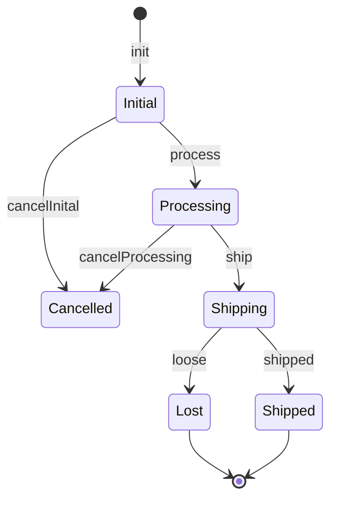

# Make impossible state transitions impossible

In any sane language you can make impossible state impossible by correct modelling and catch mistakes at compile time already.

But what about state _transitions_? And in compile time? We had a discussion at Oslo Elm conference 2019. Then I wrote a suggested solution and posted it here [https://discourse.elm-lang.org/t/making-impossible-state-transitions-impossible-oslo-elm-day-question/3159](https://discourse.elm-lang.org/t/making-impossible-state-transitions-impossible-oslo-elm-day-question/3159).

Here you find a model of an order tracking system. An order goes through different states but not all transitions are possible. The proof is in that `Main.elm` do not compile as it tries to break the rules of the state machine.

This repository keeps the code. And 2023 I believe I should write a Readme too! 
